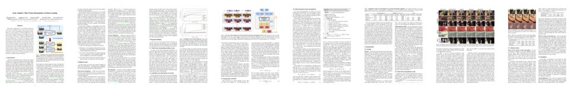
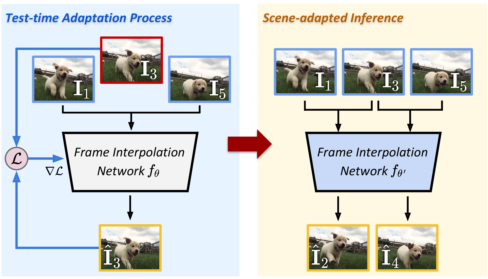
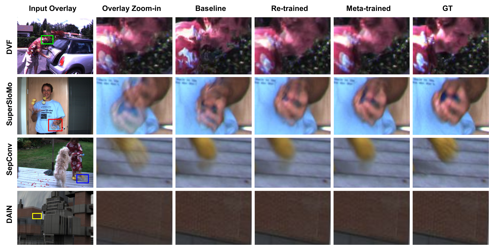
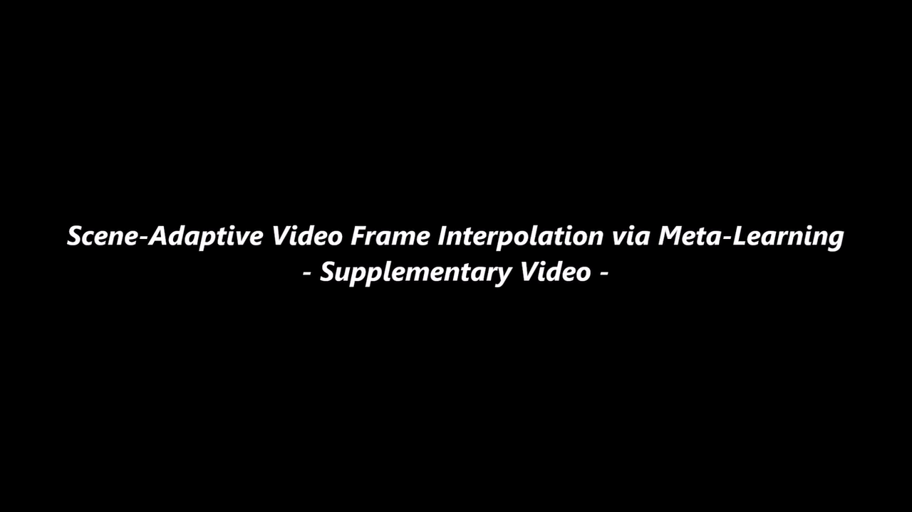

#### [Myungsub Choi](https://myungsub.github.io), Janghoon Choi, Sungyong Baik, Tae Hyun Kim, Kyoung Mu Lee

[Project](https://myungsub.github.io/meta-interpolation) | [Paper-CVF](http://openaccess.thecvf.com/content_CVPR_2020/papers/Choi_Scene-Adaptive_Video_Frame_Interpolation_via_Meta-Learning_CVPR_2020_paper.pdf) | [Paper-ArXiv](https://arxiv.org/abs/2004.00779) | [Supp](http://openaccess.thecvf.com/content_CVPR_2020/supplemental/Choi_Scene-Adaptive_Video_Frame_CVPR_2020_supplemental.zip)

<a href="https://arxiv.org/abs/2004.00779" rel="Video"></a>

## Abstract

Video frame interpolation is a challenging problem be-cause there are different scenarios for each video depending  on the variety of foreground and background motion,frame rate, and occlusion. It is therefore difficult for a single network with fixed parameters to generalize across different videos. Ideally, one could have a different network for each scenario, but this is computationally infeasible for practical applications. In this work, we propose to adapt the model to each video by making use of additional information that is readily available at test time and yet has not been exploited in previous works. We first show the benefits of ‘test-time adaptation’ through simple fine-tuning of a network, then we greatly improve its efficiency by incorporating meta-learning. We obtain significant performance gains with only a single gradient update without any additional parameters. Finally, we show that our meta-learning framework can be easily employed to any video frame interpolation network and can consistently improve its performance on multiple benchmark datasets.

## Model

<center></center>

- Download pretrained models from [[Here](https://www.dropbox.com/sh/4pphxdw8k3j34dq/AABRr61SSw09zVgfjYXlaHe3a?dl=0)]


## Dataset Preparation

- [ [Vimeo90K Septuplet dataset](http://toflow.csail.mit.edu/) ]
- [ [Middlebury-OTHERS dataset](http://vision.middlebury.edu/flow/data/) ] - download `other-color-allframes.zip` and `other-gt-interp.zip`
- [ [HD dataset](https://github.com/baowenbo/MEMC-Net#hd-dataset-results) ] - download the original ground truth videos [[here](https://merced-my.sharepoint.com/:u:/g/personal/wbao2_ucmerced_edu/EU-1cwJsIGJLmGsIz6a30sEBo-Jv2DWcw65qElR5xwh6VA?e=spBaNI)]


## Results

- Qualitative results for VimeoSeptuplet dataset

<center></center>

- Qualitative results for Middlebury-OTHERS dataset

<center></center>

- Qualitative results for HD dataset

<center></center>


### Additional Results Video

<center><a href="https://www.dropbox.com/s/6h4hyeiuoulzyk7/07235-supp-video.mp4" rel="Video"></a></center>


## Citation

If you find this code useful for your research, please consider citing the following paper:

``` text
@inproceedings{choi2020meta,
    author = {Choi, Myungsub and Choi, Janghoon and Baik, Sungyong and Kim, Tae Hyun and Lee, Kyoung Mu},
    title = {Scene-Adaptive Video Frame Interpolation via Meta-Learning},
    booktitle = {CVPR},
    year = {2020}
}
```

## Acknowledgement

The main structure of this code is based on [MAML++](https://github.com/AntreasAntoniou/HowToTrainYourMAMLPytorch).
Training scripts for each of the frame interpolation method is adopted from: [[DVF](https://github.com/lxx1991/pytorch-voxel-flow)], [[SuperSloMo](https://github.com/avinashpaliwal/Super-SloMo)], [[SepConv](https://github.com/sniklaus/sepconv-slomo)], [[DAIN](https://github.com/baowenbo/DAIN)], [[CAIN](https://github.com/myungsub/CAIN)]
We thank the authors for sharing the codes for their great works.

---
For further questions, please contact [@myungsub](https://myungsub.github.io)